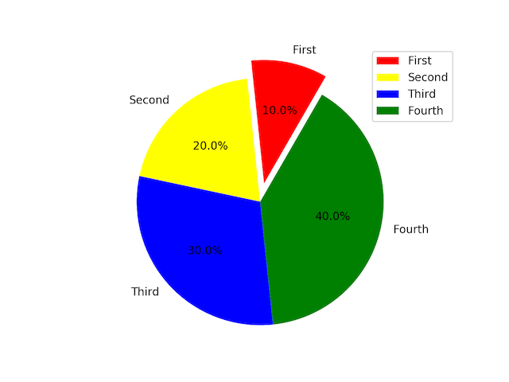
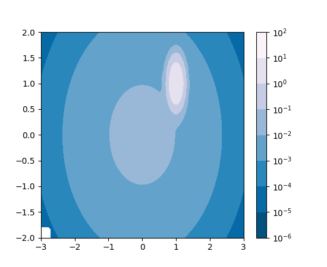
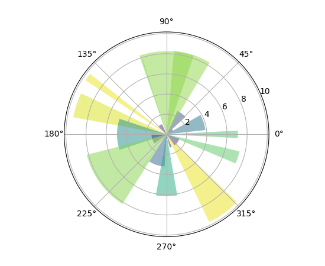
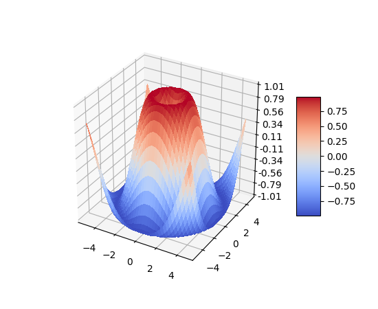

在进行AI学习、统计的时候，通常用Matplotlib进行数据的可视化，本文总结下Matplotlib中基本用法，首先import matplotlib.pyplot as plt。

## 基本用法

Matplotlib可以绘制很多种类型的图，见底部参考，常见的是折线图，其次还有散点图、柱状图、条状图、饼图、动态图、3D图等。

<!-- more -->

### 折线图

先备注下常用api

```
fig = plt.figure() #开始画图
plt.plot(X, Y, 'b-', lw=2.5, label='label') #指定x、y轴坐标值，线宽、此条线名称
plt.legend(loc='upper left') # 注解位置
plt.xlim(x_min, x_max) # 设置x轴坐标轴范围，也可以通过ylim设置y轴范围
plt.xticks([x1, x2, x3, x4]) #设置x轴坐标轴刻度
plt.show() 显示图
```

下表包含了plot可以使用的风格:

标记 | 连接线型	| &nbsp;　　　　　 |  标记 | 数据点型
---- | ---- | ---- | --- | ----- 
-	 | 实线（默认） |  | 	+	 | 加号
--	 | 虚线	 ||  o	 | 圆圈
:	 | 点线 | | 	* | 	星号
-. | 	点划线 ||  	.	 | 实心点
**标记**	 | **颜色** ||  	x | 	叉
r	 | 红 | | 	s | 	正方形
g	 | 绿 | | 	d | 	钻石
b	 | 蓝 | | 	^ | 	上三角
c	 | 蓝绿 ||  	v	 | 下三角
m	 | 紫红 | | 	<	 | 左三角
y	 | 黄	 ||  >	 | 右三角
k	 | 黑	 | | p | 	正五角形
w	 | 白	 ||  h	 | 正六角形

颜色除了预定义好的单个字母表示，还可以用color='#00ff00'或者color=(1.0, 0.5, 0.04)表示。

一个简单示例

```
import matplotlib.pyplot as plt
from matplotlib.font_manager import FontProperties

# https://www.jianshu.com/p/8ed59ac76c06 中文显示问题
def getChineseFont():
    return FontProperties(fname='/System/Library/Fonts/PingFang.ttc', size=15)

plt.rcParams['axes.unicode_minus'] = False  # 用来正常显示负号

y = [1, 15, 3, 6, 23]

plt.figure()
plt.title(u'绘制中文标题', fontproperties=getChineseFont())
plt.ylabel(u'Y轴label', fontproperties=getChineseFont())
plt.ylim(0, 30)
plt.yticks(range(0, 30, 5))
plt.plot(range(0, 5), y, "r:o", label="折线图label")
plt.show()
```
下图中红色的即是画出来的折线图效果


### 柱状图

只要将上个示例中的plot换成plt.scatter(range(0, 5), y, color='m', label="散点图label")即可画出柱状图，即上图中蓝绿色的柱子。

### 条状图

plot换成plt.barh(range(0, 5), y, color='y', label="条形图label")


### 散点图

plot换成plt.scatter(range(0, 5), y, color='m', label="散点图label")


### 饼状图

```
list = np.array([1, 2, 3, 4])
plt.pie(list)
plt.show()

最简单的如上，给个数组即可，一般指定其他参数以使得图像更可读，下面这个还用上面的list。

labels = [u'First', 'Second', 'Third', 'Fourth'] //每块饼的标签文本
colors = ['red', 'Yellow', 'blue', 'green'] //每块饼的颜色
explode = (0.15, 0, 0, 0) //每块饼突出图形的比例
plt.pie(list, explode=explode, labels=labels
	, colors=colors, startangle=60 //startangle 第一块开始的角度
	, labeldistance=1.1 //标签文本距离圆心的半径比例
	, pctdistance=0.6 //百分比文本距离圆心的半径比例
	, autopct='%.1f%%') //百分比的格式化形式
plt.axis('equal') //x、y轴坐标系相等，这样画出来整体就是圆形
plt.legend() //需要图例
plt.show()

```


### 等高线图

```
来自 https://matplotlib.org/examples/images_contours_and_fields/contourf_log.html

import matplotlib.pyplot as plt
import numpy as np
from numpy import ma
from matplotlib import colors, ticker, cm
from matplotlib.mlab import bivariate_normal

N = 100
x = np.linspace(-3.0, 3.0, N)
y = np.linspace(-2.0, 2.0, N)

X, Y = np.meshgrid(x, y)

z = (bivariate_normal(X, Y, 0.1, 0.2, 1.0, 1.0)
     + 0.1 * bivariate_normal(X, Y, 1.0, 1.0, 0.0, 0.0))

z[:5, :5] = -1

z = ma.masked_where(z <= 0, z)

fig, ax = plt.subplots()
cs = ax.contourf(X, Y, z, locator=ticker.LogLocator(), cmap=cm.PuBu_r)
cbar = fig.colorbar(cs)
plt.show()
```



### 灰度图

### 量场图

### 极轴图

```
来自https://matplotlib.org/examples/pie_and_polar_charts/polar_bar_demo.html

import numpy as np
import matplotlib.pyplot as plt

# Compute pie slices
N = 20
theta = np.linspace(0.0, 2 * np.pi, N, endpoint=False)
radii = 10 * np.random.rand(N)
width = np.pi / 4 * np.random.rand(N)

ax = plt.subplot(111, projection='polar')
bars = ax.bar(theta, radii, width=width, bottom=0.0)

# Use custom colors and opacity
for r, bar in zip(radii, bars):
    bar.set_facecolor(plt.cm.viridis(r / 10.))
    bar.set_alpha(0.5)

plt.show()
```



### 动态图

```
import matplotlib.pyplot as plt
import numpy as np

x = np.arange(6)
y = np.arange(5)
z = x * y[:, np.newaxis]

for i in range(5):
    if i == 0:
        p = plt.imshow(z)
        fig = plt.gcf()
        plt.clim()   # clamp the color limits
        plt.title("Boring slide show")
    else:
        z = z + 2
        p.set_data(z)

    print("step", i)
    plt.pause(0.5)

通过每隔0.5s动态更新形成动画
```

### 3D图

```
来自https://matplotlib.org/examples/mplot3d/surface3d_demo.html

from mpl_toolkits.mplot3d import Axes3D

import matplotlib.pyplot as plt
from matplotlib import cm
from matplotlib.ticker import LinearLocator, FormatStrFormatter
import numpy as np

fig = plt.figure()
ax = fig.gca(projection='3d')

X = np.arange(-5, 5, 0.25)
Y = np.arange(-5, 5, 0.25)
X, Y = np.meshgrid(X, Y)
R = np.sqrt(X ** 2 + Y ** 2)
Z = np.sin(R)

surf = ax.plot_surface(X, Y, Z, cmap=cm.coolwarm,
                       linewidth=0, antialiased=False)

ax.set_zlim(-1.01, 1.01)
ax.zaxis.set_major_locator(LinearLocator(10))
ax.zaxis.set_major_formatter(FormatStrFormatter('%.02f'))

fig.colorbar(surf, shrink=0.5, aspect=5)

plt.show()
```



3D图还可以拖动用不同角度观看，实际上matplot能支持的图形还远不止这些，可以参考底部官方文档的参考。

## 一些有趣示例

### 自定义坐标系画三角函数

```
import matplotlib.pyplot as plt
import numpy as np

# 在(−π,π)之间分成共256个点，
X = np.linspace(-np.pi, np.pi, 256, endpoint=True)
(C, S) = np.cos(X), np.sin(X)

fig = plt.figure()

plt.plot(X, C, 'b-', lw=2.5, label='cos')
plt.plot(X, S, 'r-', lw=1.5, label='sin')

plt.legend(loc='upper left')

plt.ylim(C.min() * 1.2, C.max() * 1.2)
plt.xlim(X.min() * 1.2, X.max() * 1.2)

# plt.xticks([-np.pi, -np.pi / 2, 0, np.pi / 2, np.pi])
# 使用LaTeX设置更易理解的标记，即数学符号π
plt.xticks([-np.pi, -np.pi / 2, 0, np.pi / 2, np.pi],
           [r'$-\pi$', r'$-\pi/2$', r'$0$', r'$\pi/2$', r'$+\pi$'])
plt.yticks([-1, 0, 1])

ax = plt.gca()
ax.spines['right'].set_color('none')  # 把右边和上边的边界设置为不可见
ax.spines['top'].set_color('none')
ax.spines['bottom'].set_position(('data', 0))  # 把下边界和左边界移动到0点
ax.spines['left'].set_position(('data', 0))

# 给特殊点添加注释
t = 2 * np.pi / 3

plt.plot([t, t], [0, np.cos(t)], color='blue', linewidth=1.0, linestyle="--")
plt.scatter([t, ], [np.cos(t), ], 50, color='blue')  # 画出需要标注的点
plt.annotate(r'$\cos(\frac{2\pi}{3})=-\frac{1}{2}$',
             xy=(t, np.cos(t)), xycoords='data',
             xytext=(-90, -50), textcoords='offset points', fontsize=16,
             arrowprops=dict(arrowstyle="->", connectionstyle="arc3,rad=.2"))

plt.plot([t, t], [0, np.sin(t)], color='red', linewidth=1.0, linestyle="--")
plt.scatter([t, ], [np.sin(t), ], 50, color='red')
plt.annotate(r'$\sin(\frac{2\pi}{3})=\frac{\sqrt{3}}{2}$',
             xy=(t, np.sin(t)), xycoords='data',
             xytext=(+10, +30), textcoords='offset points', fontsize=16,
             arrowprops=dict(arrowstyle="->", connectionstyle="arc3,rad=.2"))

# for label in ax.get_xticklabels() + ax.get_yticklabels():
#     label.set_fontsize(16)
#     label.set_bbox(dict(facecolor='w', edgecolor='None', alpha=0.4))

plt.show()
```


### numpy里画的正态分布图

```
# Build a vector of 10000 normal deviates with variance 0.5^2 and mean 2
mu, sigma = 2, 0.5
v = np.random.normal(mu, sigma, 5000)
# Plot a normalized histogram with 50 bins
plt.hist(v, bins=50, normed=1)  # matplotlib version (plot)

# Compute the histogram with numpy and then plot it
(n, bins) = np.histogram(v, bins=50, normed=True)  # NumPy version (no plot)
plt.plot(.5 * (bins[1:] + bins[:-1]), n)
plt.show()

# 简化版 http://blog.csdn.net/lanchunhui/article/details/50163669
loc = 10.0
scale = 1.0
data = np.random.normal(loc, scale, size=6000)
x_data = np.linspace(data.min(), data.max())
plt.plot(x_data, 1. / (np.sqrt(2 * np.pi) * scale) * np.exp(-(x_data - loc) ** 2 / (2 * scale ** 2)))
count, bins, _ = plt.hist(data, 30, normed=True)
plt.show()
```


除此之外，还可以画子图，还有大量api可供使用，画出更绚丽的图片来，可看参考里的官方文档尝试。

## 参考

https://matplotlib.org/gallery.html

https://matplotlib.org/examples/pylab_examples/mathtext_examples.html

https://docs.scipy.org/doc/numpy-dev/user/quickstart.html

https://www.jianshu.com/p/7fbecf5255f0

https://liam0205.me/2014/09/11/matplotlib-tutorial-zh-cn/

http://conanwhf.github.io/2018/02/12/DrawByMatplotlib/

## 　

本文首发于[钱凯凯的博客](http://qianhk.com) : http://qianhk.com/2018/03/客户端码农学习ML-Matplotlib基本用法/
