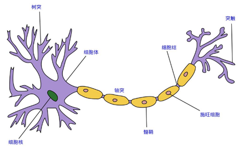
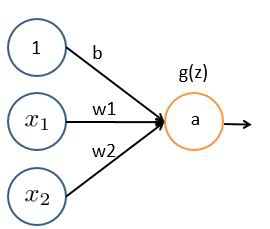
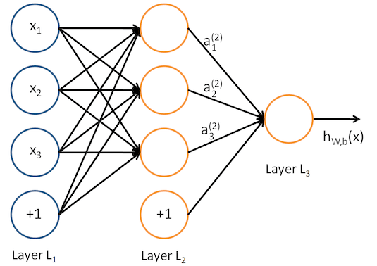
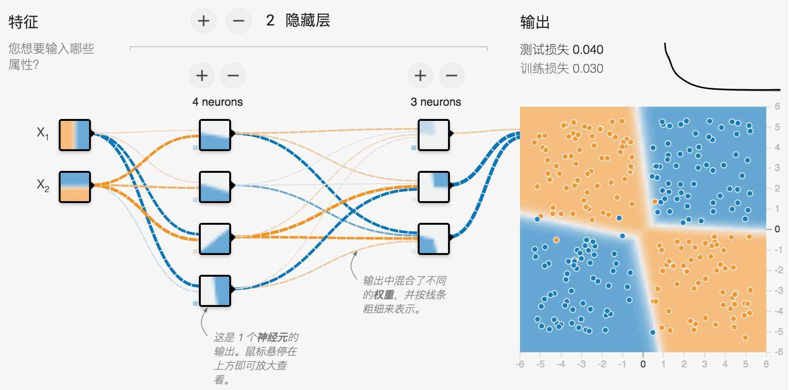

<!--more-->


## 由来

在初步学习了线性回归算法、逻辑回归分类算法并练习后，终于学习到了神经网络(Neural Network)。

神经网络是模仿生物大脑中的神经网络设计而成，每个神经元接受外部刺激，进行一点处理，输出到下个神经元，众多神经元合作完成了对外部刺激的反应，并输出行动指令。

每个神经元都可以被认为是一个处理单元，它含有许多输入/树突 (input/Dendrite)，并且有一个输出/轴突(output/Axon)。神经网络是大量神经元相互链接并通过电脉冲来交流的一个网络。



神经网络模型建立在很多神经元之上，每一个神经元又是一个个学习模型。这些神经元采纳一些特征作为输入，并且根据本身的模型提供一个输出。下图是一个以逻辑回归模型作为神经元的示例，在神经网络中，参数又可被成为权重(weight)。



当我们增加多个神经元后，就可以形成下图的神经网络模型：



其中第一层输入层，含有x1 , x2 , x3等输入特征，我们将原始数据输入给它们。 
第二层是隐藏层，a1 , a2 , a3是中间单元，它们负责将数据进行处理，然后呈递到下一层。
第三层，输出单元，它负责计算

上去就是一个简单的全连接神经网络, 下面我用先用神经网络模拟个逻辑与、或试试手。

也可以先到google官方Neural Network Playground体验下。



## 逻辑与、或

码农对于逻辑与、或的规则很清楚，如下表：

参数1  | 参数2 | 结果：AND | 结果: OR
:----:|:-----:|:-------:|:-------:|
0  | 0 | 0 | 0
0  | 1 | 0 | 1
1  | 0 | 0 | 1
1  | 1 | 1 | 1

我们需要的训练就是输入参数后能输出1或者0的结果，与逻辑二分类算法有点像，但是神经网络使用不同的损失函数来训练。

```
# 首先准备样本共4个，有特征x1、x2，x0是bias，固定值1。
x0 = np.array([1, 1, 1, 1], dtype=np.float32)
x1 = np.array([0, 0, 1, 1], dtype=np.float32)
x2 = np.array([0, 1, 0, 1], dtype=np.float32)

# 然后准备目标值target
if arg_type == 'AND':
    target = np.array([0, 0, 0, 1], dtype=np.float32)
else arg_type == 'OR':
    target = np.array([0, 1, 1, 1], dtype=np.float32)

# 把特征和目标值转成矩证以便下面使用
m_x = np.vstack((x0, x1, x2)).T
m_target = np.matrix(target).T
```

然后写TensorFlow计算图，定义网络：

```
v_w = tf.Variable(np.zeros((3, 1)), dtype=tf.float32)
h_x = tf.placeholder(shape=[None, 3], dtype=tf.float32)
h_target = tf.placeholder(shape=[None, 1], dtype=tf.float32)

z = tf.matmul(h_x, v_w)
loss = tf.nn.sigmoid_cross_entropy_with_logits(logits=z, labels=h_target)
loss = tf.reduce_mean(loss)
optimizer = tf.train.GradientDescentOptimizer(200)
train = optimizer.minimize(loss)
```

最后进行训练:

```
sess = tf.Session()
sess.run(tf.global_variables_initializer())

loss_vec = []

for step in range(401):
    feed_dict = {h_x: m_x, h_target: m_target}
    sess.run(train, feed_dict)
    loss_vec.append(sess.run(loss, feed_dict=feed_dict))
    if step % 100 == 0:
        print('step=%d W=%s loss=%s' % (
            step, sess.run(v_w).ravel(), sess.run(loss, feed_dict=feed_dict)))

_w = sess.run(v_w).ravel()
sess.close()
```

如果是AND，那么最后的W=[-75.  50.  50.] loss极低，只有1.0416e-11，换句话说：y = sigmoid(-75 + 50 * x<sub>1</sub> + 50 * x<sub>2</sub>)

如果是OR，那么最后的W=[-25.  50.  50.]，换句话说：y = sigmoid(-25 + 50 * x<sub>1</sub> + 50 * x<sub>2</sub>)

## Mnist手写数字数据集

我们用机器学习界的Hello Word：Mnist手写数字识别来体验下全连接神经网络。

官网（http://yann.lecun.com/exdb/mnist/），除了有下载地址，还有各种算法历年来拿这个数据集练手的最佳纪录。

该数据集也可以通过from tensorflow.examples.tutorials.mnist import input_data自动下载，mnist = input_data.read_data_sets('./cache/mnist/', one_hot=True)，指定缓存目录即可。

```
print(f'Train data size: {mnist.train.num_examples}')
print(f'Validation data size: {mnist.validation.num_examples}')
print(f'Test data size: {mnist.test.num_examples}')
```

通过上述代码可得知，训练集样本: 55000，验证集样本：5000，测试集样本10000条。

训练时可以通过xset, yset = mnist.train.next_batch(batch_size: 8)取的一批数据，xset里是特征值，yset里是目标值，单个特征的shape是(784,)，即图片长宽分别为28*28，单个独热编码形式的label.shape=(10,)，形如[ 0.  0.  0.  0.  0.  0.  0.  1.  0.  0.]

## 实现Mnist数据集训练NN

由于图片尺寸是28*28，所以输入特征有784个，因此输入层是784个节点。

目标值是0到9共10个数字，所以输出层是10个节点。

我们定义隐藏层为500个节点。


## 总结


## 参考：

[Google Neural Network Playground](http://playground.tensorflow.org/#activation=tanh&batchSize=10&dataset=circle&regDataset=reg-plane&learningRate=0.03&regularizationRate=0&noise=0&networkShape=4,2&seed=0.06451&showTestData=false&discretize=false&percTrainData=50&x=true&y=true&xTimesY=false&xSquared=false&ySquared=false&cosX=false&sinX=false&cosY=false&sinY=false&collectStats=false&problem=classification&initZero=false&hideText=false)

吴恩达机器学习教程：
http://study.163.com/course/introduction/1004570029.htm

## 　

本文首发于[钱凯凯的博客](http://qianhk.com) : http://qianhk.com/2018/09/全连接神经网络训练手写图片识别/
