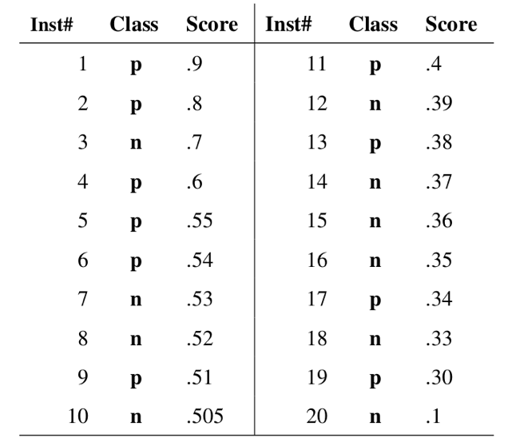

正样本、负样本解释

TP TN FP FN

<!--more-->

## 准确率 Accuracy

准确率通常是我们最容易想到的一个评估分类模型的指标。通俗来说，准确率是指我们的模型预测正确的结果所占的比例。其值等于预测正确的样本数除以总样本数，取值范围[0,1]。

## 精确率 Precision 和召回率 Recall

精确率指标尝试回答以下问题：

在被识别为正类别的样本中，确实为正类别的比例是多少？

召回率
召回率尝试回答以下问题：

在所有正类别样本中，被正确识别为正类别的比例是多少？

## ROC、曲线下面积

TPR      true positive rate   等同召回率Recall
FPR      false positive rate
ROC     Receiver Operating Characteristic Curve 接收者操作特征曲线
AUC     Area Under Curve score 曲线下面积值

ROC 曲线（接收者操作特征曲线）是一种显示分类模型在所有分类阈值下的效果的图表。该曲线绘制了真正例率、假正例率两个参数。

## 参考：

[精确率和召回率](https://developers.google.cn/machine-learning/crash-course/classification/precision-and-recall)

[ROC 和曲线下面积](https://developers.google.cn/machine-learning/crash-course/classification/roc-and-auc)

## 　

本文首发于[钱凯凯的博客](http://qianhk.com) : http://qianhk.com/2018/08/分类评估(准确率_精确率和召回率_ROC和曲线下面积)/

