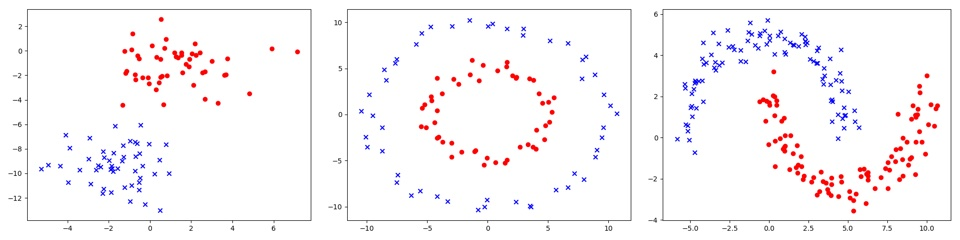
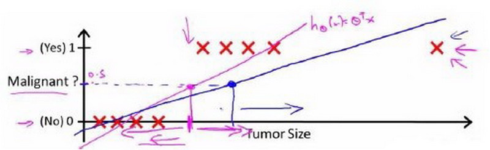
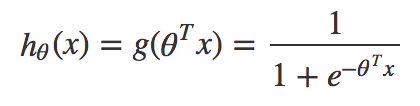
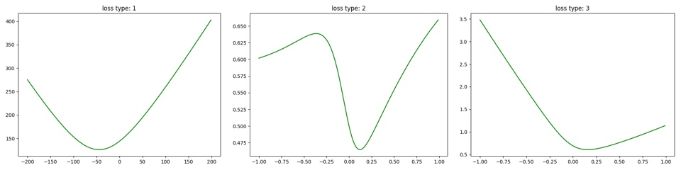
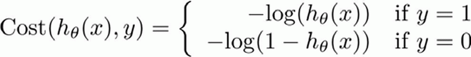
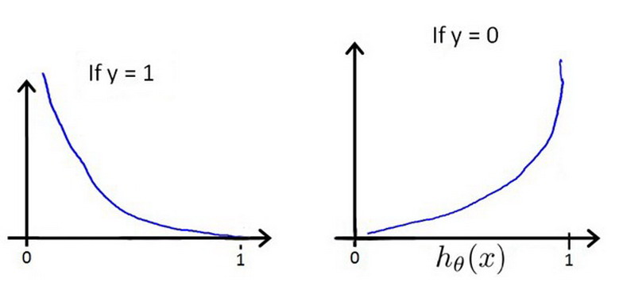
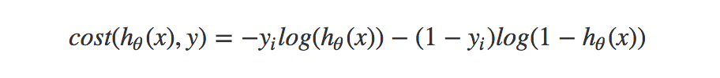

## 分类问题

在线性回归中，预测的是连续值，而在分类问题中，预测的是离散值，预测的结果是特征属于哪个类别以及概率，比如是否垃圾邮件、肿瘤是良性还是恶性、根据花瓣大小判断哪种花，一般从最简单的二元分类开始，通常将一种类别表示为1，另一种类别表示为0。

如下图，分别是几种不同的分类样式：



## 分类方法

如果我们用线性回归算法来解决一个分类问题，那么假设函数的输出值可能远大于1，或者远小于0，会导致吴恩达机器学习教程中提到的分类不准或者阈值难以选择问题。



数学家们脑袋一转，想出来著名的sigmoid function，又名S形函数，是机器学习中诸多算法常用的一种激活函数，其图形如：


输出始终在0-1之间，完美应用在二分类问题，同时还能给出预测的概率。

将线性回归的输出应用sigmoid函数后，即得到逻辑回归的模型函数，又名假设函数Hypothesis:



## 损失函数

在线性回归中，一般采用样本误差的平方和来计算损失，批量训练中求均方误差MSE或者均方根误差RMSE，此方法的损失函数是凸函数，我们通过遍历待定系数w画图形或者数学计算可证明。凸函数便于通过梯度下降法求出最优解。在一个特征下损失函数形如抛物线, 如下图中左边的子图:



在加了sigmoid函数后，继续采用平方和来计算损失，得到的损失函数将不是个凸函数，难以求出全局最优解，图形绘制如上图中间的子图。

数学家们脑袋又一转，又想到了对数损失函数。



当y=1时，图形形如下图中的左图，如果预测正确，损失为0，如果预测错误，损失无穷大。当y=0时，同样如果预测正确，损失为0，如果预测错误，损失无穷大。



写成一个完整的函数后变成：



这个复杂的函数对于自变量θ是一个凸函数，画出的图形可看上面绿色图形中右边的子图，数学证明可求证二阶导数非负，可参考：[http://sofasofa.io/forum_main_post.php?postid=1000921](http://sofasofa.io/forum_main_post.php?postid=1000921)

## 代码实现分类

### 绘制损失函数图形

首先准备数据和工具方法

```
import numpy as np
import matplotlib.pyplot as plt

data = [(1, 0), (2, 0), (10, 1)]

var_x = np.array([x for x, y in data])
var_y = np.array([y for x, y in data])

def sigmoid(z):
    exp = np_exp(-z)
    return 1.0 / (1 + exp)

def np_exp(array):
    return np.exp(np.minimum(array, 700))

def np_log(array):
    return np.log(np.maximum(array, 1e-250))
```

定义计算代码，实现多种损失函数计算，为便于绘制图形，假设b是固定值，只考虑w1系数变化，代码中的w参数等同于上述原理公式中的θ

```
loss_type = 3

def calc_loss(_b=0, _w1=0):
    result_mul = np.multiply(var_x, _w1)
    result_add = result_mul + _b
    result_sigmoid = sigmoid(result_add)

    if loss_type == 1 or loss_type == 2:
        if loss_type == 1:
            loss_array = np.square(result_add - var_y)  # linear regression square loss
        else:
            loss_array = np.square(result_sigmoid - var_y)  # logistic regression square loss
        return np.sqrt(np.mean(loss_array))
    elif loss_type == 3:
        first = np.multiply(-var_y, np_log(result_sigmoid))  # logistic regression log loss
        second = (1 - var_y) * np_log(1 - result_sigmoid)
        loss_array = first - second
        return np.average(loss_array)
    else:
        loss_array = np.maximum(result_add, 0) - result_add * var_y + np.log(1 + np.exp(-np.abs(result_add)))
        return np.average(loss_array)
```

绘制出图形

```
if __name__ == '__main__':
    loss_vec = []

    max_n = 1
    b = 0
    test_range = np.arange(-max_n, max_n, 0.01)
    for step in test_range:
        loss = calc_loss(b, step)
        loss_vec.append(loss)

    plt.figure()
    plt.title('loss type: ' + str(loss_type))
    plt.plot(test_range, loss_vec, 'g-')
    plt.show()
```

### 实现可线性分类的样本

导入库，生成mock数据，并定义h(θ)

```
import numpy as np
import tensorflow as tf
from sklearn import datasets

random_state = np.random.RandomState(2)
data, target = datasets.make_blobs(n_samples=123, n_features=2, centers=2, cluster_std=2.0, random_state=random_state)
target = np.array(target, dtype=np.float32)
# print('data=%s' % data)
# print('target=%s' % target)

b = tf.Variable(0, dtype=tf.float32, name='b')
w1 = tf.Variable([[0]], dtype=tf.float32, name='w1')
w2 = tf.Variable([[0]], dtype=tf.float32, name='w2')

x_data1 = tf.placeholder(shape=[None, 1], dtype=tf.float32)
x_data2 = tf.placeholder(shape=[None, 1], dtype=tf.float32)
y_target = tf.placeholder(shape=[None, 1], dtype=tf.float32)

result_matmul1 = tf.matmul(x_data1, w1)
result_matmul2 = tf.matmul(x_data2, w2)
result_add = result_matmul1 + result_matmul2 + b
```

## 多类别分类


## 参考：

[http://sofasofa.io/forum_main_post.php?postid=1000921](http://sofasofa.io/forum_main_post.php?postid=1000921)

## 　

本文首发于[钱凯凯的博客](http://qianhk.com) : http://qianhk.com/2018/02/客户端码农学习ML-逻辑回归分类算法/


